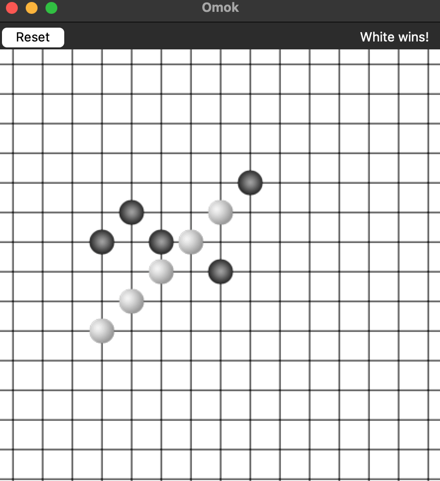
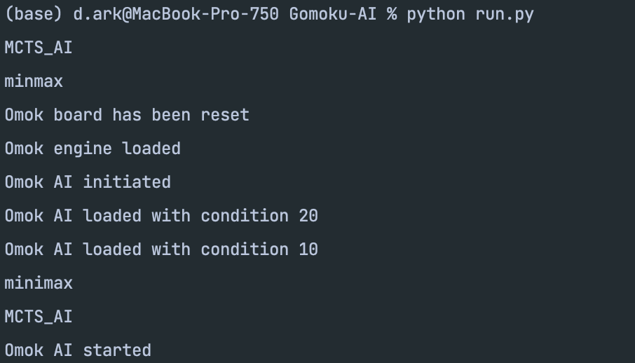
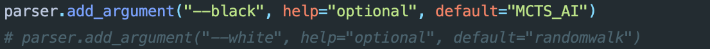
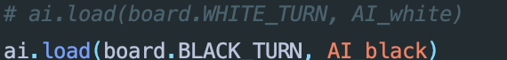
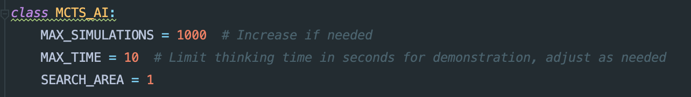
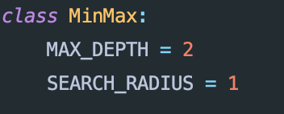
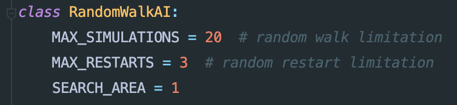

# Gomoku-AI

## Team member contributions 
**Weizhe Jiao** implements the original MCTS and enhanced MCTS with heuristics.

**Fanhao** Zhou implements the Randomwalk with heuristics, refined minimax methods. 

We both implemented the timer for each class and revised the run.py to better play and record the game.


## How to run:
First cd to the desired directory, then git clone our repository:

```commandline
git clone https://github.com/TTJustinJ/Gomoku-AI.git
```
and type the following on your command line
```commandline
python run.py
```
Then a window will show up on your computer using GUI (Might be in different desktop if you have multiples)

Also, you can check the terminal:


## How to change the settings:

### Black or White:

Go to run.py file and uncomment the ai you want to use and change **"--black"** to **"--white"**, or the other way around.


### Play with AI

If you just want to reproduce our code, and see how AI competes each other, then **skip this part.**

Additionally, if you want to play with the AI, you can comment one of the ai.load() in ./omok/res/omok.py


In this picture, the only AI activated is the one we chose as black side (MCTS if that's aligned with the above setting).

You can play with each AI by changing the corresponding setting and choose either side by comment one of the ai.

However, make sure there are black and white AI initialized in run.py. 

### The hyperparameters

You can check the code for each AI at /omok/ai and change the parameters as long as they make sense:






## Environment Setup
There are no special environments needed in this project. But we recommended you use python version later than 3.7.


## Credit
Weizhe Jiao used ChatGPT to assist with the code of MCTS. All the contributions mentioned above are 
implementations by us. Minimax was adopted but refined, and the Gomoku game board was designed by 
[this repository](https://github.com/StuartSul/Five_in_a_Row/tree/master/omok/core). 
https://github.com/StuartSul/Five_in_a_Row/tree/master/omok/core

Thanks to my roommate to test these AI methods' intelligence. 


